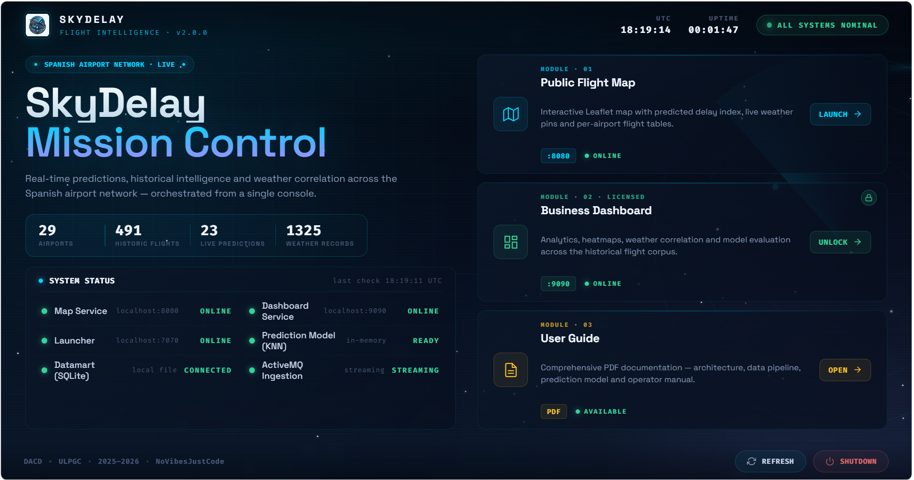
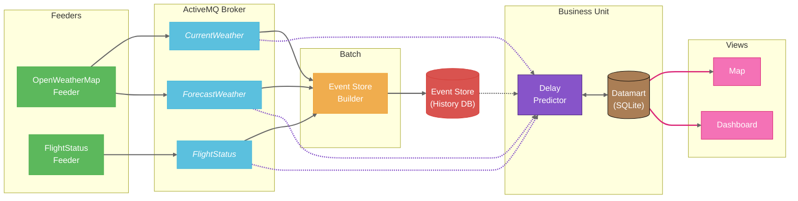
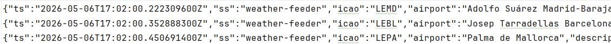
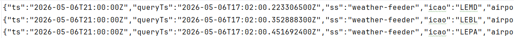
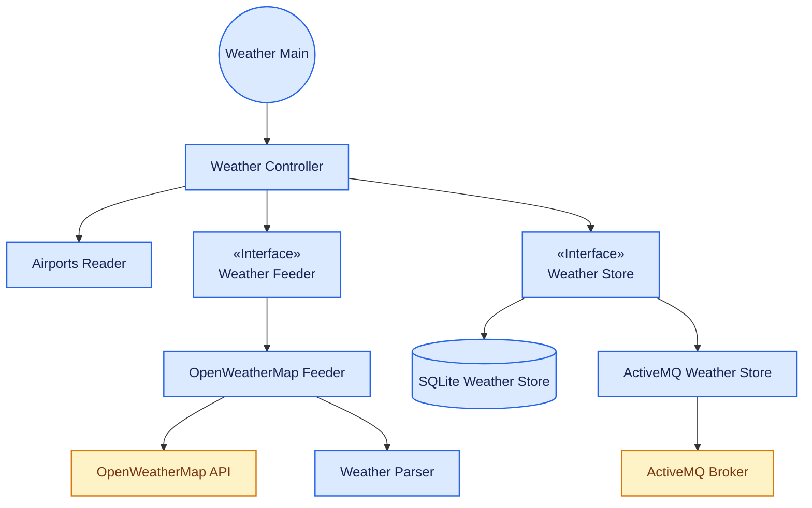
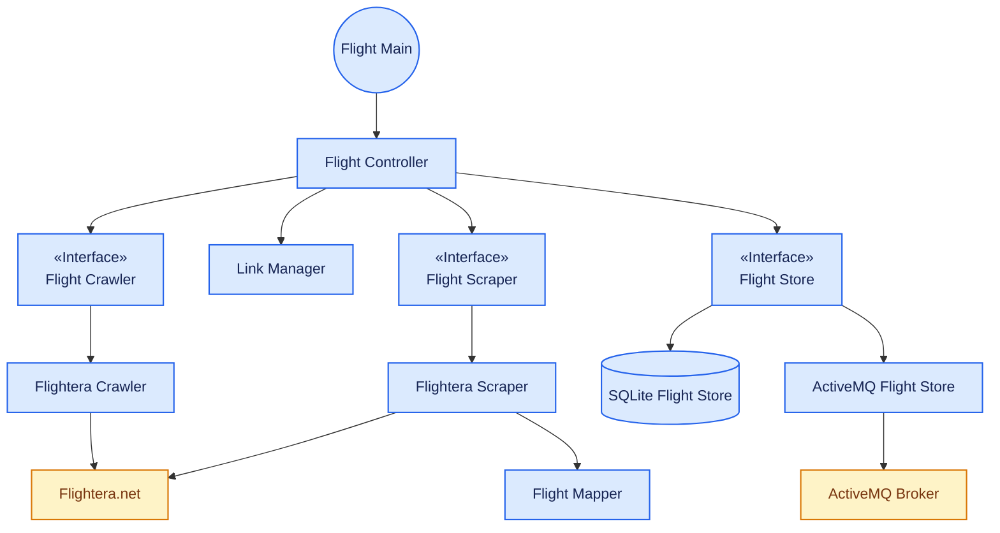
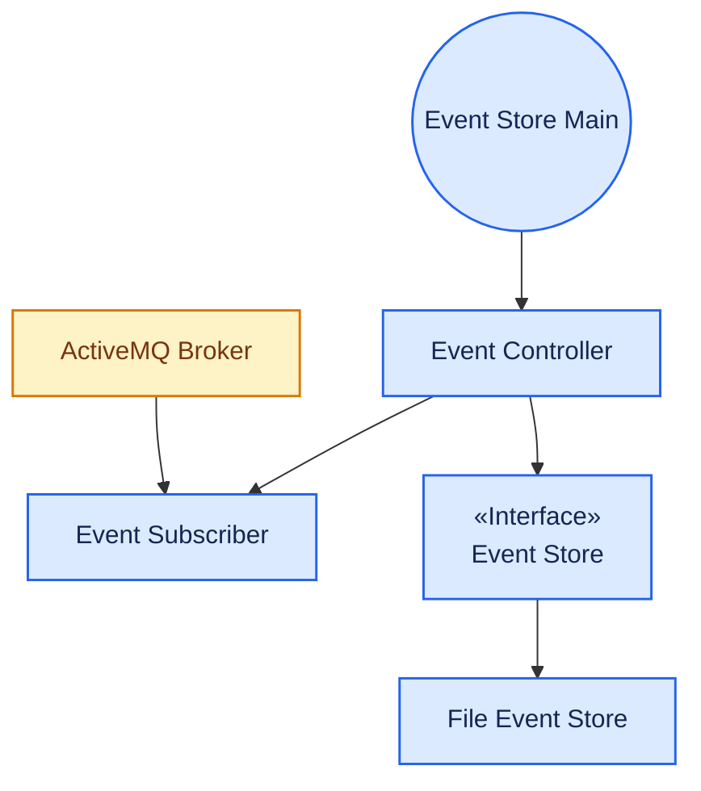
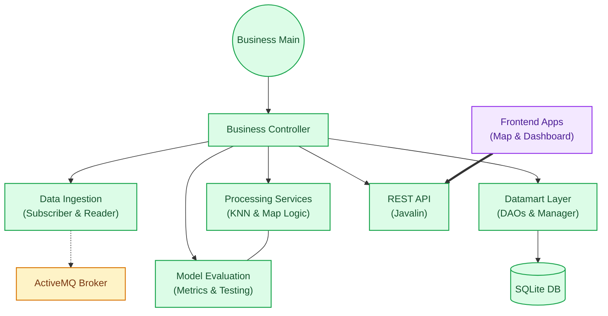

# SkyDelayForecast

> **Predicting Spain's airport bottlenecks before they happen by crossing OpenWeatherMap insights with real-time flight scraping.**

<p align="center">
  
  
  
  
  
  
  
  
  
  
</p>

---

## Project Overview
`SkyDelayForecast` is a data-driven platform designed to identify and forecast congestion at Spain's major airports.

The main objective of the project is to provide an analytical tool that relates weather conditions with the punctuality performance of airlines. Through the use of web scraping techniques and external API consumption, the system collects data that is subsequently normalized and stored for analysis. The central Business Unit uses this data to train and execute a classifier based on the K-Nearest Neighbors (KNN) algorithm, offering a visual interface for querying predictions and statistics.

### Project Structure

```text
sky-delay-forecast/
├── .idea/                      # IntelliJ IDEA project configuration files
├── business-unit/              # Core business logic, data processing, Datamart management, REST API, and GUI backend
├── docs/                       # Project documentation, user guides, media (logos, screenshots), and demo videos
├── event-store-builder/        # Event subscriber: persists raw incoming events into the local Event Store
├── flight-status-feeder/       # Feeder: scrapes and streams real-time flight data to the broker
├── openweathermap-feeder/      # Feeder: fetches and streams real-time weather and forecasts to the broker
├── samples/                    # Real data samples from the Event Store and Datamart
├── storage/                    # Centralized local data storage
│   ├── data/                   # Dynamic files (e.g., pending flight links)
│   └── references/             # Reference files templates (e.g., airports.csv)
├── web/                        # Web dashboard interface and map visualization
├── .env.example                # Template for environment variables and API keys
├── .gitattributes              # Git configuration for language statistics and attributes
├── .gitignore                  # Specifies intentionally untracked files to ignore
├── LICENSE                     # Open-source project license (GNU GPLv3)
├── README.md                   # Project overview and execution manual 
└── pom.xml                     # Root Maven configuration for managing multi-module dependencies
```

### Value Proposition & User Features

The platform delivers tailored visual tools divided into public access and premium enterprise tiers:

* **Public Flight Map & Search Table:** Accessible to all users, this unified interface features an interactive geographic map where airports are pinned and evaluated using a visual 1-OTP (On-Time Performance) range, integrated alongside a searchable table to quickly check whether a specific flight is prone to or undergoing a delay.
* **Advanced Analytics Dashboard (Subscription Only):** Designed specifically for aeronautical companies, sector stakeholders and hardcore aviation enthusiasts. This interactive control panel delivers deep insights from historical data, featuring multi-metric charts, airport-specific OTP breakdowns, Pearson correlation analysis for weather conditions, heatmaps, and pattern detection.

---

## Data Sources & Datamart Structure

To ensure the accuracy of our forecasts, we have selected sources that balance accessibility, geographical flexibility, and operational depth.

### Justification of Sources

1. [**OpenWeatherMap**](https://openweathermap.org/api) **(API):** We selected this API over local alternatives like AEMET because it offers a more comprehensive free tier for student developers. More importantly, OpenWeatherMap allows for data retrieval via precise **geographical coordinates** (Latitude/Longitude), providing higher spatial accuracy for airport locations compared to AEMET’s locality-based (municipality) system.


2. [**Flightera**](https://www.flightera.net) **(Web Scraping):** Unlike many commercial aviation APIs that impose severe quota limitations or high costs, scraping Flightera allows us to obtain detailed historical logs and real-time flight statuses—such as specific aircraft models and granular delay data—which are essential for feeding our KNN model without hitting restrictive paywalls.

### Datamart Schema

The information is organized into a **SQLite Datamart** structured into three main tables to optimize both model training and dashboard visualization. This relational approach was preferred over flat CSV files to enable fast indexing, seamless table joins, and efficient row-level updates for incoming predictions.

**1. `flight_features` (Historical Flight Data)** *Used for model training, crossing each flight instance with the weather conditions at that specific time.*

| flight_id | origin_icao | dest_icao | temp | wind | gust | vis | distance | departure_delay | delay_category | scheduled_departure | aircraft_model |
| --- | --- | --- | --- | --- | --- | --- | --- | --- | --- |---------------------| --- |


**2. `flight_predictions` (Live Model Output)** *Stores the inferences generated by the KNN algorithm for upcoming scheduled flights.*

| flight_id | origin_icao | dest_icao | scheduled_time | predicted_category | last_updated |
| --- | --- | --- |----------------|--------------------|--------------|


**3. `weather_records` (Meteorological Snapshots)** *A historical log of conditions at each airport used for correlation analysis and trend detection.*

| airport_icao | temp | wind_speed | wind_gust | visibility | timestamp |
| --- | --- | --- | --- | --- | --- |

---

## Prerequisites

To correctly run the system, the following is required:
1.  **Java Development Kit (JDK) 21** or higher.
2.  **Apache Maven** installed and configured in the PATH.
3.  **Apache ActiveMQ** running (default on port 61616).
4.  Internet connection for scraping and OpenWeatherMap API access.
5.  Configuration arguments for each module (file paths, broker URLs, etc.).

## Configuration and Installation

1.  **Clone the repository**:
    ```bash
    git clone https://github.com/NoVibesJustCode/sky-delay-forecast.git
    cd sky-delay-forecast
    ```

2.  **Compile the project**:
    From the project root, run:
    ```bash
    mvn clean install
    ```


3. **Environment Setup**:
   The project relies on environment variables for API keys and browser configurations. A template is provided in the repository root. Duplicate it and fill in your local values:
    ```bash
    cp .env.example .env
    ```
   Open the newly created `.env` file and replace the placeholder values with your specific configuration:

   ```ini
    # --- Security & Credentials ---
    # Get your key at https://openweathermap.org/api
    OPENWEATHERMAP_API_KEY=your_api_key_here
    
    # --- Browser Configuration (Local Paths) ---
    # Windows example: C:/Program Files/Google/Chrome/Application/chrome.exe
    # macOS example: /Applications/Google Chrome.app/Contents/MacOS/Google Chrome
    # Linux example: /usr/bin/google-chrome
    CHROME_EXECUTABLE_PATH=path/to/your/chrome/executable
    
    # Directory where session, cookies, and cache will be stored
    CHROME_USER_DATA=./user-data-dir
    ```

   > ℹ️ **Browser Compatibility:** While the `.env.example` file and properties reference Chromium/Chrome defaults, you are not strictly limited to Google Chrome. You can point `CHROME_EXECUTABLE_PATH` to any modern Chromium-based binary (such as Brave, Microsoft Edge, or Chromium) installed on your system, provided it supports standard automated CLI flags and user-data separation.

---

## Module Execution

The project follows an event-driven architecture where each module operates independently. Instead of building and running `.jar` files manually, **it is highly recommended to run the modules directly from IntelliJ IDEA**.

### ActiveMQ
Before launching the modules, ensure your message broker (**Apache ActiveMQ**) is active and running.
* *Default broker URL:* `tcp://localhost:61616`

---

### Step-by-Step Execution in IntelliJ IDEA

#### 1. Navigate to the Project Root
Make sure you have cloned the repository and opened the root directory (`sky-delay-forecast`) in IntelliJ IDEA.

#### 2. Locate the Main Classes
You can find the `Main` class for each module by navigating through the project tree (`src/main/java/...`) or by using the **Search Everywhere** shortcut:
* **All Platforms (Windows/Linux/macOS):** Press `Shift` twice.
* *Type `Main` or the specific module name to open the file instantly.*

#### 3. Configure and Run Each Module
For each module, right-click the `Main` file and select **Modify Run Configuration...** (or *Edit Configurations...*). In the **Program arguments** field, paste the required arguments separated by spaces with their values in the exact order shown below:

##### Event Store Builder
Subscribes to the broker to persist incoming events into a structured local directory.
* **Program Arguments:**
    ```bash 
    <broker_url> <path_to_event_store_dir>
    ```

##### OpenWeatherMap Feeder
Requires the broker URL, the targeted topic names (`weather` and `forecast`) and an external file containing airport information (IATA/ICAO codes, locations, etc.).

_You can find a template for the required format in `storage/references/airports.csv`._

* **Program Arguments:**
    ```bash 
    <broker_url> <topic_name1> <topic_name2> <path_to_airports_data_csv> 
    ```

##### Flight Status Feeder
Requires the broker URL, the topic name (`flight`) and the path to the file that stores the flight links generated by the crawler for later scraping (_e.g., ```storage/data/pending_flight_links.txt```_).

* **Program Arguments:**
    ```bash
    <broker_url> <topic_name> <path_to_pending_links_txt>
    ```

##### Business Unit
Requires the broker URL, the Event Store directory path (_e.g., ```eventstore/```_), the SQLite database path (_e.g., ```storage/db/datamart.db```_) and the airport data file (_e.g., ```storage/references/airports.csv```_).

* **Program Arguments:**
    ```bash
    <broker_url> <path_to_event_store_dir> <path_to_datamart_db> <path_to_airports_data_csv> 
    ```
---

Once the arguments are configured, click the green **Run (Play)** button for each module. They will run concurrently in independent terminal tabs within IntelliJ.

---

> After starting the Business Unit, you can access the platform's visual suite through the main GUI. From there, you can navigate to either the public tools or the subscription-based analytics panel:
>
> * **Predictive Map & Flight Table:** `http://localhost:8080` (Main interface containing the interactive geographic map and the live flight-delay lookup table).
>
>
> * **Analytics Dashboard:** `http://localhost:9090` (Premium enterprise control panel). When navigating to this view, use the following default credentials to log in:
>   * **Password:** `admin123`
>

---

## Usage Examples

Once the system is fully operational and the Business Unit is serving data, you can interact with the two specialized frontend views. These demos showcase how the real-time weather and flight streams are transformed into actionable insights.

### 1. Application Launcher

The central entry point of the platform. This GUI provides direct access to all components of the application, alongside real-time system status metrics.



From this unified launcher, users can seamlessly navigate to three main resources:
* **Interactive Map:** Opens the live, color-coded predictive flight tracking workspace.
* **Analytics Dashboard:** Grants access to the premium enterprise statistical control panel.
* **PDF User Guide:** Opens a brief system documentation for end-users.

### 2. Interactive Predictive Map

The map provides a geographical overview of the Spanish airspace, visualizing airports and active flights through a dynamic, color-coded system.Airports are color-coded based on their current delay performance, utilizing the metric $1 - \text{OTP}$ (On-Time Performance) to reflect the exact magnitude of ongoing departures from the schedule. In addition to this real-time status, the map integrates live meteorological conditions to display predictive insights, forecasting whether upcoming flights are likely to experience delays or proceed on schedule.

https://github.com/user-attachments/assets/d59a9e4f-389e-4dba-9a52-2b396abb5b5c

---

### 3. Premium Analytics Dashboard

Designed for administrative and operational oversight, the dashboard consolidates historical data and evaluates how weather influences flights.

https://github.com/user-attachments/assets/d6ce9866-5eca-482b-85b3-aaf8b0a50642

---

## System Architecture

The system is engineered combining **Event-Driven Architecture** and **Lambda Architecture** patterns. It runs independent decoupled modules via a message broker (Apache ActiveMQ) to achieve two goals simultaneously: managing immutable long-term data warehousing for machine learning re-training, and handling low-latency real-time prediction pipelines.

1.  **Data Producers (Feeders)**: Capture information from external sources and publish it to the broker.
2.  **Message Broker**: Acts as an intermediary, ensuring decoupling between producers and consumers.
3.  **Event Store Builder**: Responsible for the long-term persistence of all events generated in the system.
4.  **Business Unit**: Consumes events, maintains an updated datamart and makes predictions.
5.  **User Interfaces**: Web applications that call the server endpoints to paint reactive visualizations, geographic overlays, and restricted metrics.

### Data Flow Diagram


## Application Architecture

### OpenWeatherMap Feeder
This module is responsible for weather data ingestion. It uses the OpenWeatherMap API to obtain detailed forecasts for the configured airports.
-   **Functionality**: Periodic querying of meteorological data (temperature, humidity, wind, precipitation).
-   **Publication**: Sends weather events to the ActiveMQ broker in JSON format.

Current Weather event format:
```txt
{"ts":"2026-05-16T08:44:28.241249400Z","ss":"weather-feeder","icao":"GCLP","airport":"Gran Canaria","description":"muy nuboso","temp":18.88,"feelsLike":18.36,"humidity":59,"visibility":10000,"windSpeed":10.29,"windGust":0.0,"cloudsPct":75}
```

<!--  -->

Forecast Weather event format:
```txt
{"ts":"2026-05-16T09:00:00Z","queryTs":"2026-05-16T08:44:28.339168100Z","ss":"weather-feeder","icao":"GCLP","airport":"Gran Canaria","description":"lluvia ligera","temp":18.88,"feelsLike":18.36,"humidity":59,"visibility":10000,"windSpeed":7.7,"windGust":8.73,"cloudsPct":75}
```

<!--  -->



### Flight Status Feeder
A module dedicated to obtaining real-time flight status information.
-   **Functionality**: Performs web scraping on flight tracking platforms (Flightera) to obtain departure/arrival times and accumulated delays.
-   **Publication**: Sends flight events to the broker for further processing.

Flight event format:
```txt
{"ts":"2026-05-16T08:44:32.078719500Z","ss":"flight-feeder","flightId":"Iberia IB1622","origin":"LPA","destination":"MAD","date":"14. May 2026","departureTimeUTC":"18:44","arrivalTimeUTC":"20:56","status":"Landed","departureDelay":54,"arrivalDelay":21,"distanceKm":1836,"aircraftModel":"Airbus A320"}
```
<!--  -->



### Event Store Builder
This component ensures the integrity and durability of the system's historical data.
-   **Functionality**: Subscribed to all relevant broker topics, it captures every event and stores it in a structured way within the file system (Event Store).
-   **Structure**: Events are organized by type and date, allowing for system state reconstruction at any point in time.



### Business Unit
The intelligent core of the project. It integrates both processing logic and user interfaces.
-   **Datamart**: Maintains a SQLite database optimized for fast queries and model training.
-   **Prediction**: Implements a prediction service based on the KNN algorithm that estimates flight delays given specific weather conditions.
-   **REST Interface**: Exposes an API using Javalin for programmatic access to data and predictions.



---

## Design Principles and Patterns Applied

To ensure a maintainable, scalable, and highly decoupled system, the architecture strictly adheres to standard software engineering patterns and SOLID principles.

### 1. SOLID Principles Implementation

* **Single Responsibility Principle (SRP):** Every class has a single purpose. Feeders only fetch data, Parsers handle raw transformations, and DAOs deal exclusively with database operations.


* **Open/Closed Principle (OCP):** The system uses interfaces to allow extensions without modifying existing code. For example, changing the ML algorithm only requires a new implementation of the `Classifier` interface.


* **Dependency Inversion Principle (DIP):** High-level controllers communicate with external infrastructures purely through abstractions (e.g., `WeatherStore`, `FlightStore`, `EventStore`, `FlightScraper`).

#### Code Example: Polymorphism & OCP via Interfaces

```java
public interface Classifier {
    String predict(double feature1, double feature2, double feature3, double feature4);
    double normalize(double value, double min, double max);
}


public class KNNClassifier implements Classifier {
    @Override
    public String predict(double temp, double wind, double gust, double vis) {
        // KNN classification logic here
        return neighbors;
    }

    @Override
    public double normalize(double val, double min, double max) {
        if (max == min) return 0.0;
        return Math.max(0.0, Math.min(1.0, (val - min) / (max - min)));
    }
}
```

---

### 2. Architectural & Behavioral Patterns

#### Data Access Object (DAO) Pattern

Isolates the business logic from low-level database changes by encapsulating SQL operations inside specialized components (`FlightHistoricalDAO`, `FlightPredictionsDAO`, `WeatherDAO`).

* **Decoupling:** `DatamartManager` uses these DAOs to interface with SQLite, meaning analytical components never execute raw SQL directly.

---

### 3. Production-Ready Logging Practices

Instead of using raw `System.out.println()`, the system implements standard SLF4J/Logback logging wrappers across all modules.

* **Traceability:** Distinct log levels (`INFO`, `WARN`, `ERROR`) map application states cleanly.
* **File Persistence Best Practice:** In production, logs are dynamically routed to standard console outputs and written into persistent files (`logs/skydelay.log`). This enables asynchronous auditing, error tracing, and post-mortem analysis without degrading live CPU performance.

---

## Future Improvements

To transition the project from an academic prototype to a robust, production-grade platform, several scalable milestones have been identified for future development:

### 1. Global Airspace Expansion

The current infrastructure is focused strictly on Spanish airports and domestic traffic.

* **Target:** Generalize the `AirportsReader` and feeder cron jobs to capture real-time operations across major international flight hubs worldwide.

### 2. High-Capacity Predictive Models

While the current decentralized structural framework fulfills all architectural guidelines, the core machine learning inference can be significantly upgraded.

* **Current Baseline:** With a limited dataset of **491 total samples**, the `KNNClassifier` achieves an **Overall Accuracy of 67.82% (0.6782)**.
* **Target:** As the `Event Store` accumulates deeper historical data, transition the `Classifier` implementation towards more robust, non-linear algorithms such as **Random Forest Ensembles** or deep **Neural Networks (MLPs)** to improve accuracy and minimize false-positive delays.

### 3. Multi-Dimensional Feature Ingestion

Flight delays are highly complex and rarely triggered by localized weather conditions alone.

* **Target:** Expand the `FlightFeature` vector and database schema to ingest broader environmental and contextual dimensions, including:
* **Airport & Airspace Congestion:** Live queue delays and runway capacity metrics.
* **Temporal Anomalies:** Calendar variations, including national holidays, long weekends, and peak holiday seasons vs. standard weekdays.
* **Historical Aircraft Turnaround:** Delay patterns chained from a plane's previous flight segments.

---

## Authors

Project developed as part of the course _Desarrollo de Aplicaciones para Ciencia de Datos (DACD)_, by [Javier Ruano Hernández](https://github.com/javierruanohdez) and [Lucas Mendoza Rodríguez.](https://github.com/Lucasmendo30)
