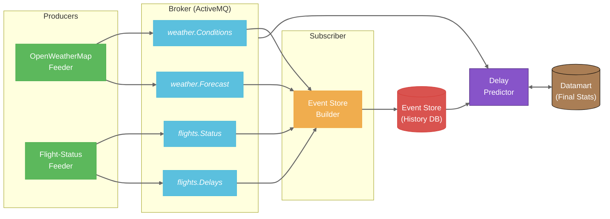
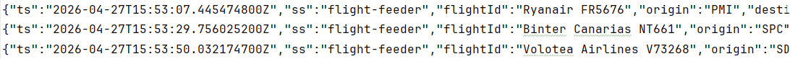

# SkyDelayForecast

> **Predicting Spain's airport bottlenecks before they happen by crossing OpenWeatherMap insights with real-time flight scraping.**

## Project Overview
`SkyDelayForecast` is a data-driven platform designed to identify and forecast congestion at Spain's major airports.

The main objective of the project is to provide an analytical tool that relates weather conditions with the punctuality performance of airlines. Through the use of web scraping techniques and external API consumption, the system collects data that is subsequently normalized and stored for analysis. The central Business Unit uses this data to train and execute a classifier based on the K-Nearest Neighbors (KNN) algorithm, offering a visual interface for querying predictions and statistics.

## System Architecture

The system is based on an **Event-Driven Architecture** consisting of independent modules that communicate through a message broker (Apache ActiveMQ). The data flow follows an Event Sourcing pattern, where every state change or new piece of information is treated as a persistent event.

1.  **Data Producers (Feeders)**: Capture information from external sources and publish it to the broker.
2.  **Message Broker**: Acts as an intermediary, ensuring decoupling between producers and consumers.
3.  **Event Store Builder**: Responsible for the long-term persistence of all events generated in the system.
4.  **Business Unit**: Consumes events, maintains an updated datamart, and exposes prediction and visualization services.

### Data Flow Diagram


## Project Modules

### OpenWeatherMap Feeder
This module is responsible for weather data ingestion. It uses the OpenWeatherMap API to obtain detailed forecasts for the configured airports.
-   **Functionality**: Periodic querying of meteorological data (temperature, humidity, wind, precipitation).
-   **Publication**: Sends weather events to the ActiveMQ broker in JSON format.

Current Weather event format:


Forecast Weather event format:


### Flight Status Feeder
A module dedicated to obtaining real-time flight status information.
-   **Functionality**: Performs web scraping on flight tracking platforms (Flightera) to obtain departure/arrival times and accumulated delays.
-   **Publication**: Sends flight events to the broker for further processing.

Flight event format:


### Event Store Builder
This component ensures the integrity and durability of the system's historical data.
-   **Functionality**: Subscribed to all relevant broker topics, it captures every event and stores it in a structured way within the file system (Event Store).
-   **Structure**: Events are organized by type and date, allowing for system state reconstruction at any point in time.

### Business Unit
The intelligent core of the project. It integrates both processing logic and user interfaces.
-   **Datamart**: Maintains a SQLite database optimized for fast queries and model training.
-   **Prediction**: Implements a prediction service based on the KNN algorithm that estimates flight delays given specific weather conditions.
-   **REST Interface**: Exposes an API using Javalin for programmatic access to data and predictions.
-   **Visualization**: Includes a JavaScript application with a Dashboard and an interactive map to visualize air traffic and delay risks.

## Technologies Used

<p align="center">
  
  
  
  
  
  
  
</p>

-   **Language**: Java 21.
-   **Dependency Management**: Maven.
-   **Message Broker**: Apache ActiveMQ.
-   **Database**: SQLite (JDBC).
-   **Web Server**: Javalin.
-   **Graphical Interface**: JavaScript (with leaflet).
-   **Serialization**: Jackson and Gson for JSON management.

## Prerequisites

To correctly run the system, the following is required:
1.  **Java Development Kit (JDK) 21** or higher.
2.  **Apache Maven** installed and configured in the PATH.
3.  **Apache ActiveMQ** running (default on port 61616).
4.  Internet connection for scraping and OpenWeatherMap API access.
5.  Configuration arguments for each module (file paths, broker URLs, etc.).

## Configuration and Installation

1.  **Clone the repository**:
    ```bash
    git clone https://github.com/usuario/sky-delay-forecast.git
    cd sky-delay-forecast
    ```

2.  **Compile the project**:
    From the project root, run:
    ```bash
    mvn clean install
    ```

## Module Execution

Each module must be run independently, preferably in the following order:

1.  **Start the Broker**: Ensure your message broker (e.g., ActiveMQ) is active and reachable.

    Default broker URL: tcp://localhost:61616

2.  **Event Store Builder**:
    Subscribes to the broker to persist incoming events.
    ```bash
    java -jar <path_to_event_store_builder_jar> <broker_url>
    ```

3.  **OpenWeatherMap Feeder**:
    Requires the broker URL, the topic names (weather and forecast) and an external file containing airport information (IATA codes, locations, etc.). You can find a template for the required format in ```storage/logs/airports.csv```.

    **Args**:
    ```bash
    java -jar <path_to_openweathermap_feeder_jar> <broker_url> <topic_name1> <topic_name2> <path_to_airports_data_csv> 
    ```

    **API-key**:
    ```prolog
    OPENWEATHERMAP_API_KEY in .env
    ```

4.  **Flight Status Feeder**:
    Requires the broker URL, the topic name (flight) and the path to the file that stores the flight links generated by the crawler for later scraping (e.g., ```storage/logs/pending_flight_links.txt```).
    ```bash
    java -jar <path_to_flight_status_feeder_jar> <broker_url> <topic_name> <path_to_pending_links_txt>
    ```

5.  **Business Unit**:
    Requires the broker URL, the Event Store directory path (```eventstore/```), the SQLite database path (e.g., ```storage/db/datamart.db```) and the airport data file.
    ```bash
    java -jar <path_to_business_unit_jar> <broker_url> <path_to_event_store_dir> <path_to_datamart_db> <path_to_airports_data_csv> 
    ```

After starting the Business Unit, you can access the web interfaces at:
-   Dashboard: `http://localhost:7070`
-   Map: `http://localhost:8080`

## Module and Class Diagram

```mermaid

flowchart TD

subgraph group_weather["Weather System"]
  node_weather_main(("Weather Main"))
  node_weather_controller["Weather Ctrl"]
  node_airports_reader["Airports Reader"]
  
  node_weather_feeder_interface["«Interface» Weather Feeder"]
  node_openweathermap_feeder["OpenWeatherMap Feeder"]
  
  node_weather_parser["Weather Parser"]
  
  node_weather_store_interface["«Interface» Weather Store"]
  node_weather_sqlite[("SQLite Weather Store")]
  node_weather_amq["ActiveMQ Weather Store"]
  
  node_weather_feeder_interface -.-> node_openweathermap_feeder
  node_weather_store_interface -.-> node_weather_sqlite
  node_weather_store_interface -.-> node_weather_amq
end

subgraph group_flight["Flight System"]
  node_flight_main(("Flight Main"))
  node_flight_controller["Flight Ctrl"]
  
  node_flight_crawler_interface["«Interface» Flight Crawler"]
  node_flightera_crawler["Flightera Crawler"]
  
  node_link_manager["Link Manager"]
  
  node_flight_scraper_interface["«Interface» Flight Scraper"]
  node_flightera_scraper["Flightera Scraper"]
  
  node_flight_mapper["Flight Mapper"]
  
  node_flight_store_interface["«Interface» Flight Store"]
  node_flight_sqlite[("SQLite Flight Store")]
  node_flight_amq["ActiveMQ Flight Store"]
  
  node_flight_crawler_interface -.-> node_flightera_crawler
  node_flight_scraper_interface -.-> node_flightera_scraper
  node_flight_store_interface -.-> node_flight_sqlite
  node_flight_store_interface -.-> node_flight_amq
end

subgraph group_event["Event System"]
  node_event_main(("Event Main"))
  node_event_controller["Event Ctrl"]
  node_event_subscriber["Event Subscriber"]
  
  node_event_store_interface["«Interface» Event Store"]
  node_event_store["File Event Store"]
  
  node_event_store_interface -.-> node_event_store
end

subgraph group_external["External systems"]
  node_amq["ActiveMQ Broker"]
  node_owm_api["OpenWeatherMap API"]
  node_flight_site["Flight Pages"]
end

%% Weather connections
node_weather_main -->|runs| node_weather_controller
node_weather_controller -->|loads airports| node_airports_reader
node_weather_controller -->|requests weather| node_weather_feeder_interface
node_openweathermap_feeder -->|calls| node_owm_api
node_openweathermap_feeder -->|raw JSON| node_weather_parser
node_weather_parser -->|stores| node_weather_store_interface
node_weather_parser -->|publishes| node_weather_store_interface
node_weather_amq -->|send to broker| node_amq

%% Flight connections
node_flight_main -->|runs| node_flight_controller
node_flight_controller -->|discovers links| node_flight_crawler_interface
node_flight_controller -->|checks state| node_link_manager
node_flightera_crawler -->|scrapes| node_flight_site
node_flight_controller -->|scrapes pages| node_flight_scraper_interface
node_flightera_scraper -->|maps data| node_flight_mapper
node_flight_mapper -->|stores| node_flight_store_interface
node_flight_mapper -->|publishes| node_flight_store_interface
node_flight_amq -->|send to broker| node_amq

%% Event connections
node_event_main -->|runs| node_event_controller
node_event_controller -->|subscribes| node_event_subscriber
node_event_subscriber -->|receives from| node_amq
node_event_controller -->|writes history| node_event_store_interface

%% Broker delivers to event subscriber
node_amq -->|delivers| node_event_subscriber

%% Click links
click node_weather_main "https://github.com/novibesjustcode/sky-delay-forecast/blob/dev/openweathermap-feeder/src/main/java/es/ulpgc/dacd/skydelay/weather/Main.java"
click node_weather_controller "https://github.com/novibesjustcode/sky-delay-forecast/blob/dev/openweathermap-feeder/src/main/java/es/ulpgc/dacd/skydelay/weather/control/Controller.java"
click node_airports_reader "https://github.com/novibesjustcode/sky-delay-forecast/blob/dev/openweathermap-feeder/src/main/java/es/ulpgc/dacd/skydelay/weather/control/AirportsReader.java"
click node_openweathermap_feeder "https://github.com/novibesjustcode/sky-delay-forecast/blob/dev/openweathermap-feeder/src/main/java/es/ulpgc/dacd/skydelay/weather/control/OpenWeatherMapFeeder.java"
click node_weather_parser "https://github.com/novibesjustcode/sky-delay-forecast/blob/dev/openweathermap-feeder/src/main/java/es/ulpgc/dacd/skydelay/weather/control/WeatherParser.java"
click node_weather_sqlite "https://github.com/novibesjustcode/sky-delay-forecast/blob/dev/openweathermap-feeder/src/main/java/es/ulpgc/dacd/skydelay/weather/control/SqliteWeatherStore.java"
click node_weather_amq "https://github.com/novibesjustcode/sky-delay-forecast/blob/dev/openweathermap-feeder/src/main/java/es/ulpgc/dacd/skydelay/weather/control/ActiveMQWeatherStore.java"
click node_flight_main "https://github.com/novibesjustcode/sky-delay-forecast/blob/dev/flight-status-feeder/src/main/java/es/ulpgc/dacd/skydelay/flights/Main.java"
click node_flight_controller "https://github.com/novibesjustcode/sky-delay-forecast/blob/dev/flight-status-feeder/src/main/java/es/ulpgc/dacd/skydelay/flights/control/Controller.java"
click node_flight_crawler_interface "https://github.com/novibesjustcode/sky-delay-forecast/blob/dev/flight-status-feeder/src/main/java/es/ulpgc/dacd/skydelay/flights/control/FlightCrawler.java"
click node_flightera_crawler "https://github.com/novibesjustcode/sky-delay-forecast/blob/dev/flight-status-feeder/src/main/java/es/ulpgc/dacd/skydelay/flights/control/FlighteraCrawler.java"
click node_link_manager "https://github.com/novibesjustcode/sky-delay-forecast/blob/dev/flight-status-feeder/src/main/java/es/ulpgc/dacd/skydelay/flights/control/LinkManager.java"
click node_flight_scraper_interface "https://github.com/novibesjustcode/sky-delay-forecast/blob/dev/flight-status-feeder/src/main/java/es/ulpgc/dacd/skydelay/flights/control/FlightScraper.java"
click node_flightera_scraper "https://github.com/novibesjustcode/sky-delay-forecast/blob/dev/flight-status-feeder/src/main/java/es/ulpgc/dacd/skydelay/flights/control/FlighteraScraper.java"
click node_flight_mapper "https://github.com/novibesjustcode/sky-delay-forecast/blob/dev/flight-status-feeder/src/main/java/es/ulpgc/dacd/skydelay/flights/control/FlightMapper.java"
click node_flight_sqlite "https://github.com/novibesjustcode/sky-delay-forecast/blob/dev/flight-status-feeder/src/main/java/es/ulpgc/dacd/skydelay/flights/control/SqliteFlightStore.java"
click node_flight_amq "https://github.com/novibesjustcode/sky-delay-forecast/blob/dev/flight-status-feeder/src/main/java/es/ulpgc/dacd/skydelay/flights/control/ActiveMqFlightStore.java"
click node_event_main "https://github.com/novibesjustcode/sky-delay-forecast/blob/dev/event-store-builder/src/main/java/es/ulpgc/dacd/skydelay/eventstore/Main.java"
click node_event_controller "https://github.com/novibesjustcode/sky-delay-forecast/blob/dev/event-store-builder/src/main/java/es/ulpgc/dacd/skydelay/eventstore/control/Controller.java"
click node_event_subscriber "https://github.com/novibesjustcode/sky-delay-forecast/blob/dev/event-store-builder/src/main/java/es/ulpgc/dacd/skydelay/eventstore/control/ActiveMQEventSubscriber.java"
click node_event_store "https://github.com/novibesjustcode/sky-delay-forecast/blob/dev/event-store-builder/src/main/java/es/ulpgc/dacd/skydelay/eventstore/control/FileEventStore.java"

classDef toneNeutral fill:#f8fafc,stroke:#334155,stroke-width:1.5px,color:#0f172a
classDef toneBlue fill:#dbeafe,stroke:#2563eb,stroke-width:1.5px,color:#172554
classDef toneAmber fill:#fef3c7,stroke:#d97706,stroke-width:1.5px,color:#78350f

class node_weather_main,node_weather_controller,node_airports_reader,node_weather_feeder_interface,node_openweathermap_feeder,node_weather_parser,node_weather_store_interface,node_weather_sqlite,node_weather_amq,node_flight_main,node_flight_controller,node_flight_crawler_interface,node_flightera_crawler,node_link_manager,node_flight_scraper_interface,node_flightera_scraper,node_flight_mapper,node_flight_store_interface,node_flight_sqlite,node_flight_amq,node_event_main,node_event_controller,node_event_subscriber,node_event_store_interface,node_event_store toneBlue
class node_amq,node_owm_api,node_flight_site toneAmber
```





## Authors

Project developed as part of the course "Desarrollo de Aplicaciones para el Ciencia de Datos" (DACD). By Lucas Mendoza Rodríguez and Javier Ruano Hernández.
