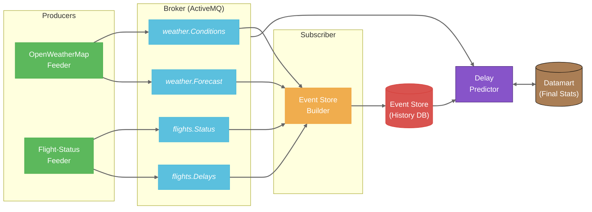
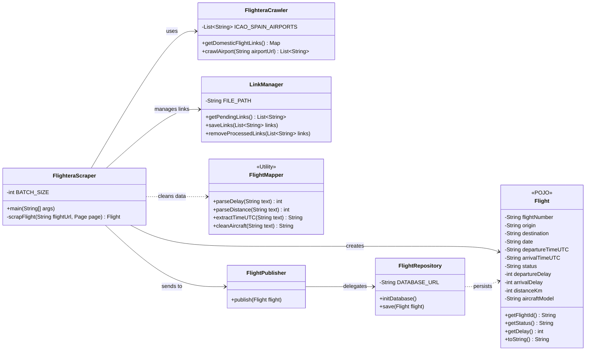

# SkyDelayForecast ⛈️✈️

> **Predicting Spain's airport bottlenecks before they happen by crossing OpenWeatherMap insights with real-time flight scraping.**

## 📌 Project Overview
`SkyDelayForecast` is a data-driven platform designed to identify and forecast congestion at Spain's major airports. The system operates by correlating two critical data streams:
1. **Detailed Weather:** Capture of microclimates and forecasts via the *OpenWeatherMap API*.
2. **Flight Status:** Real-time web scraping of flight boards to detect delays and cancellations.

By cross-referencing these variables, the system visualizes how specific weather phenomena impact the operational efficiency of Spanish aerial nodes.

## 🏗️ System Architecture
The project follows an Event-Driven Architecture (EDA) divided into independent modules:

* **`openweathermap-feeder`**: Ingests high-resolution weather data.
* **`flight-delays-feeder`**: Dynamic scraper for real-time flight statuses.
* **`Event Store`**: Persistent storage for historical event analysis and pattern recognition.

### Data Flow Diagram

## ⚙️ Technical Design

### Class Diagram: `flight-status-feeder`
The following diagram illustrates the internal structure of the flight scraping module, following a layered architecture for separation of concerns:

