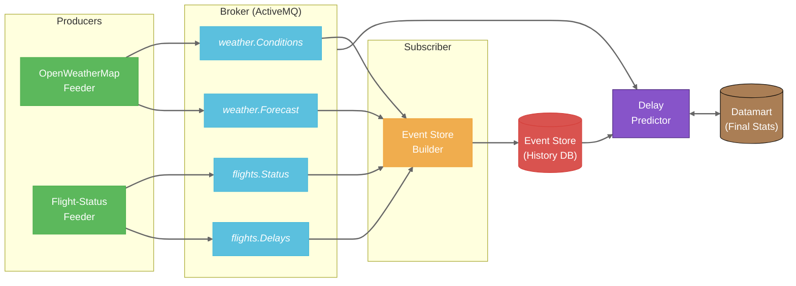

# SkyDelayForecast ⛈️✈️

> **Predicting Spain's airport bottlenecks before they happen by crossing OpenWeatherMap insights with real-time flight scraping.**

## 📌 Project Overview
`SkyDelayForecast` is a data-driven platform designed to identify and forecast congestion at Spain's major airports. The system operates by correlating two critical data streams:
1. **Detailed Weather:** Capture of microclimates and forecasts via the *OpenWeatherMap API*.
2. **Flight Status:** Real-time web scraping of flight boards to detect delays and cancellations.

By cross-referencing these variables, the system visualizes how specific weather phenomena impact the operational efficiency of Spanish aerial nodes.

## 🏗️ System Architecture
The project follows an Event-Driven Architecture (EDA) divided into independent modules:

* **`openweathermap-feeder`**: Ingests high-resolution weather data.
* **`flight-delays-feeder`**: Dynamic scraper for real-time flight statuses.
* **`Event Store`**: Persistent storage for historical event analysis and pattern recognition.

### Data Flow Diagram


## ⚙️ Technical Design

### Class Diagram: `openweathermap-feeder`
The following diagram illustrates the internal structure of the weather API module, following a layered architecture for separation of concerns:

````mermaid
---
config:
  layout: elk
---
classDiagram
direction LR
    class Airport {
	    +String icao
	    +String name
	    +double lat
	    +double lon
    }

    class Weather {
	    +String icao
	    +String airport
	    +String description
	    +double temp
	    +double feelsLike
	    +int humidity
	    +int visibility
	    +double windSpeed
	    +double windGust
	    +int cloudsPct
	    +long timestamp
    }

    class WeatherFeeder {
	    +fetch() List~Weather~
    }

    class WeatherStore {
	    +save(Weather w) void
    }

    class OpenWeatherMapFeeder {
	    -String apiKey
	    -HttpClient client
	    -AirportsReader airportsReader
	    -WeatherParser parser
	    -AirportsReader airportReader
	    +fetch() List~Weather~
	    -fetchRawJson(double lat, double lon) String
    }

    class SqliteWeatherStore {
	    -String connectionUrl
	    +save(Weather w) void
	    -initTable() void
    }

    class WeatherParser {
	    +parse(String jsonRaw, String icao, String airportName) Weather
    }

    class AirportsReader {
	    -String csvPath
	    +read() List~Airport~
    }

    class Control {
	    -WeatherFeeder feeder
	    -WeatherStore store
	    +execute() void
    }

    class Main {
	    +main(String[] args) static
	    -searchForIcao(WeatherFeeder feeder, String icao) static
    }

	<<record>> Airport
	<<record>> Weather
	<<interface>> WeatherFeeder
	<<interface>> WeatherStore

    OpenWeatherMapFeeder ..|> WeatherFeeder : implements
    SqliteWeatherStore ..|> WeatherStore : implements
    Control --> WeatherFeeder : uses
    Control --> WeatherStore : uses
    OpenWeatherMapFeeder --> AirportsReader : uses
    OpenWeatherMapFeeder --> WeatherParser : uses
    AirportsReader ..> Airport : creates
    WeatherParser ..> Weather : creates
    Main ..> Control : orchestrates
    Main ..> OpenWeatherMapFeeder : uses
````

